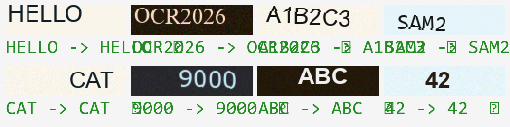

<div align="center">

# 🔍 SceneOCR

**端到端场景文本检测 + 识别引擎**

从零实现 · 双头架构（DBNet 检测 + CTC 识别）· 合成数据管线 · 断点续训

[](https://www.python.org/)
[](LICENSE)
[](https://pytorch.org/)


</div>

---

## ✨ 项目简介

一个**从零实现**的端到端 OCR 系统，覆盖场景文本的 **检测（DBNet）** 与 **识别（CTC）** 两条主线：

- 🎯 **检测**：可微分二值化（DB）让"阈值"也成为网络输出，整条检测流程端到端可训；
  OHEM 难例挖掘解决文本像素占比过小的类别不平衡。
- 🔤 **识别**：CTC 特征序列对齐，不依赖固定位置，对变长文本 / 随机偏移 / 旋转天然健壮。
- 🧪 **合成数据管线**：多字体 / 背景 / 旋转 / 噪声 / 模糊的文本行与整图文本框生成。
- 💾 **训练基础设施**：断点保存 / 续训、日志跟踪、验证集评估，训练随时可中断不丢进度。

## 🖼️ 识别效果

<div align="center">
  
  <br>
  <sub>36 字符词表，全增强（多字体/旋转/噪声/模糊）合成数据训练后的单图推理</sub>
</div>

## 🔍 端到端检测案例

检测器用**成熟预训练权重**（CRAFT，easyocr 提供），对真实照片定位文本区域：

<div align="center">
  
  <br>
  <sub>真实照片文本检测：绿色框为检测器定位的文本区域（正确命中所有文字）</sub>
</div>

端到端管线（`examples/ocr_end2end.py`）＝ 成熟检测器(CRAFT) + 自研 CTC 识别器：
```
真实图片 → [CRAFT 检测] → 文本框 → 裁剪 → [自研 CTC 识别] → 文字
```
当前：检测✅ 已用成熟权重开箱即用；识别❌ 真实数据仍需微调（模型目前只在合成数据上训练）。

## 🏗️ 系统架构

```
                        ┌──────────────────────────────────────┐
        整图 ──────────►│          文本检测（DBNet）            │
                        │  多尺度骨干 → FPN → DBNetHead        │
                        │  概率图 + 阈值图 → 可微分二值化        │
                        └──────────────┬───────────────────────┘
                                       │ 文本框 / 文本区域掩膜
                                       ▼
                        ┌──────────────────────────────────────┐
        文本行裁剪 ────►│          文本识别（CTC）              │
                        │  卷积骨干 → 序列编码 → 逐列打分       │
                        │  CTC 对齐 → 变长文字输出              │
                        └──────────────┬───────────────────────┘
                                       ▼
                                  "OCR2026"
```

- **视觉特征提取**：自实现的层次化多尺度视觉骨干 + 特征金字塔（FPN），输出多分辨率特征供检测使用。
- **DBNet 检测头**：`sigmoid(k·(prob − thr))` 可微分二值化，把阈值图也纳入学习；
  训练用 **OHEM** 聚焦文本像素，克服前景占比过小。
- **CTC 识别头**：特征图 → 逐列打分，`ctc_loss` 自动对齐变长文本，**无需固定位置对齐**。

## 📊 训练结果

| 任务 | 数据 | 词表/难度 | 指标 |
|---|---|---|---|
| 文本识别（CTC） | 合成 3000 张（全增强） | 10 数字 | **整串 98.5%** |
| 文本识别（CTC） | 合成 5000 张（全增强） | 36 字母数字 | **整串 94.5%** |
| 文本检测 | 合成整图 | 随机文本框 | **二值掩膜 IoU 94%** |
| 文本检测 | 合成矩形（冒烟） | 3 个矩形 | **IoU 100%** |
| 文本检测 | SynthText 真实数据 | — | 见下方说明 |

**检测的诚实说明**：DBNet 实现已对照成熟开源方案（PaddleOCR-DBNet）逐项校准——
损失（binary 用 Dice 对收缩图 + 全程 mask + 软阈值图）、数据增强（随机裁剪含文本区域）、
优化器（Adam amsgrad + WarmupPolyLR）。**合成域验证收敛**（矩形 100%、自研合成 94%），
证明实现正确；真实数据（SynthText/TD500）目前受训练规模限制未收敛（原版需 1200 轮 × 80 万张），
下一步计划从预训练骨干初始化 + 蒸馏加速。

## 🚀 快速开始

```bash
# 识别预训练（合成数据，断点自动保存）
python examples/pretrain_ctc.py \
    --alphabet "0123456789ABCDEFGHIJKLMNOPQRSTUVWXYZ" \
    --fixed_size 5000 --steps 4000 --ckpt checkpoints/ctc_full.pt

# 识别单图推理
python examples/infer_ctc.py --ckpt checkpoints/ctc_full.pt

# 检测预训练（合成整图）
python examples/pretrain_detector.py --data synth \
    --steps 2000 --ckpt checkpoints/det_synth.pt

# 检测微调（真实数据，低学习率只载权重）
python examples/pretrain_detector.py \
    --data <MSRA-TD500路径> --lr 1e-4 \
    --init_ckpt checkpoints/det_synth.pt --steps 1500
```

> 所有训练脚本支持 `--resume` 断点续训 + 日志落盘 + 验证集评估。

## 🎮 训练与终止 / 续训

**一键启动**（Windows）：双击对应 `.bat`，想停就按 `Ctrl+C`（自动保存断点，下次双击自动续训）：

| 脚本 | 作用 |
|---|---|
| `train_detector.bat` | 检测长训（SynthText + 预训练骨干，断点续训） |
| `train_recognizer.bat` | 识别长训（合成文本行，断点续训） |

**手动命令**：

```bash
# 检测长训（开始）
python examples/pretrain_detector.py \
    --data synthtext --synthtext_max 100000 --img_size 640 --batch 2 \
    --train_backbone \
    --pretrained_backbone <预训练Hiera路径> \
    --steps 30000 --ckpt checkpoints/det_long.pt --log logs/det_long.log

# 终止: Ctrl+C → 自动存断点 → 再次运行(加 --resume)即从断点续训
python examples/pretrain_detector.py --data synthtext ... --resume
```

**断点续训机制**：
- 每 `--save_every` 步 + Ctrl+C 中断时 + 训练完成时都会保存完整断点
- 断点包含：模型 / 优化器 / 调度器 / 当前步数 / 最优指标 —— 续训后完全无缝
- 日志追加到 `--log` 文件，崩溃/中断后能看历史曲线

## 📁 目录结构

```
SceneOCR/
├── components/            # 视觉组件库（自实现）
│   ├── backbone/          # 层次化多尺度骨干
│   ├── neck/              # FPN + 位置编码
│   ├── attention/         # 多头注意力 / RoPE / 双向 Transformer / MLP
│   └── blocks/            # ConvNeXt 块 / LayerNorm2d / DropPath
├── heads/                 # OCR 双头
│   ├── detection.py       # DBNetHead（概率图+阈值图+可微分二值化）
│   ├── losses.py          # DBNet 损失（L_s + αL_t + βL_b + OHEM）
│   ├── recognition_ctc.py # CTCHead（卷积骨干 + 序列编码 + 逐列分类）
│   └── ctc_utils.py       # CTC 编码 / 贪心解码
├── data/                  # 数据管线
│   ├── synth.py           # 文本行合成生成器（识别）
│   ├── synth_det.py       # 整图文本框合成生成器（检测）
│   ├── td500.py           # MSRA-TD500 解析
│   ├── synthtext.py       # SynthText 数据集（缓存 + 中文路径兼容）
│   ├── synthtext_preprocess.py  # SynthText gt.mat → 轻量缓存
│   ├── db_masks.py        # DBNet GT 掩膜（收缩图/掩膜/软阈值图）
│   └── det_augment.py     # 检测增强（随机裁剪含文本 + 翻转）
├── examples/              # 训练 / 推理脚本
│   ├── pretrain_ctc.py          # 识别预训练（断点/日志/验证）
│   ├── pretrain_detector.py     # 检测预训练 / 微调（支持预训练骨干）
│   ├── infer_ctc.py             # 识别单图推理 demo
│   ├── ocr_end2end.py           # 端到端：成熟检测(CRAFT) + 自研识别
│   └── train_recognizer.py      # 识别训练（EOS 并行解码对比版）
└── docs/                  # 文档与效果图
```

## 🗺️ Roadmap

- [x] 识别头（CTC）合成预训练，36 字符 **94.5%**
- [x] 检测头（DBNet）+ 损失/数据/训练配置对齐成熟方案
- [x] 合成检测预训练（域内 IoU **94%**，矩形冒烟 **100%**）
- [x] SynthText 数据管线（缓存/解析/增强）
- [x] 预训练骨干初始化（加载预训练 Hiera）
- [x] 端到端管线（成熟 CRAFT 检测 + 自研 CTC 识别）
- [ ] **识别真实数据微调**（识别当前只在合成数据上训过，真实图需微调）← 下一步
- [ ] SynthText 检测长训（受算力限制）
- [ ] 知识蒸馏（从成熟模型学软输出）
- [ ] 中文词表扩展 / 模型轻量化

## 📝 技术笔记：DBNet 检测训练的关键点

对照成熟开源方案（PaddleOCR-DBNet）逐项校准后的核心经验，是本次踩坑的沉淀：

1. **binary 图损失必须用 Dice 对收缩图**，不能对完整图用 BCE——否则和概率图的目标冲突，训练震荡。
2. **全程带 mask**（shrink_mask / threshold_mask），只监督有效文本区域与阈值边界带，背景不直接进损失。
3. **阈值图是软值 0.3~0.7 的距离图**，不是 0/1 硬边界——让阈值学得更平滑。
4. **概率图用 BalanceCE（OHEM）**：全部正样本 + 最难 top-k 负样本，缓解文本像素占比过小。
5. **随机裁剪保证每样本含文本**（EastRandomCropData 思路）：避免"大半是背景"的样本带偏模型。
6. **优化器**：Adam(amsgrad=True, weight_decay=0) + WarmupPolyLR（预热 3 轮 + 多项式衰减）。
7. **训练规模是硬约束**：原版 SynthText 是 1200 轮 × 80 万张；小规模从头训不收敛是正常的，
   解决靠预训练骨干初始化 / 蒸馏 / 足够算力，而非继续调损失。

## 📚 数据集

| 数据集 | 用途 | 说明 |
|---|---|---|
| 合成文本行 | 识别预训练 | 自研生成器，多字体/背景/旋转/噪声 |
| 合成整图 | 检测预训练 | 自研生成器，随机背景 + 文本框 |
| MSRA-TD500 | 检测真实微调 | 500 张自然场景（研究用途）|
| SynthText | 检测预训练（进行中）| 80 万张自然背景合成图（研究用途）|

## 📄 License

[Apache-2.0](LICENSE)

---

*Acknowledgments: 视觉特征部分的设计参考了 Hiera（层次化视觉 Transformer）及 FPN 等公开发表的架构思路；检测 / 识别头、数据管线、训练基础设施为本项目独立实现。*
