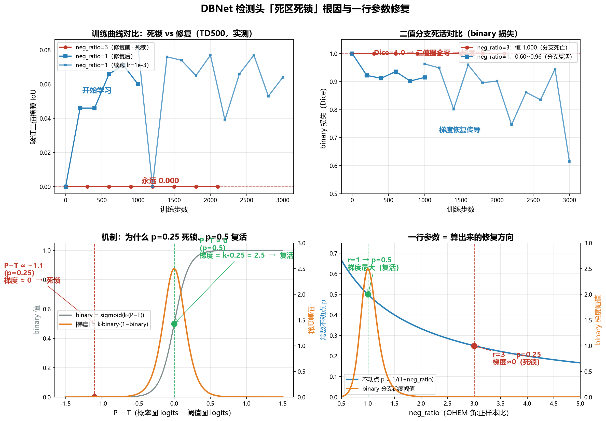

# 一个"学不会"的检测头：从 IoU 0.000 到正常收敛的排查实录

> **场景**：自研 DBNet 文本检测头（Hiera 骨干 + FPN + 可微分二值化），在真实数据集上训练数千步，
> 验证 IoU 恒为 **0.000**，损失纹丝不动。同一份代码，在合成数据上却能收敛到 **0.94**。
> 一个"薛定谔的检测头"——同样的实现，有的数据能学，有的数据永远学不会。
>
> 本文记录从症状到根因的完整排查过程：**三个层次的问题、一次数学上的灵光一现、一行参数的修复**。
> 所有结论均有对照实验和可复现数据支撑。

---

## 1. 背景：项目在做什么

一个从零实现的端到端 OCR 系统（SceneOCR），检测分支采用 **DBNet**（可微分二值化文本检测）：

```
整图 ──► Hiera 多尺度 ViT 骨干 ──► FPN Neck ──► DBNetHead ──► {概率图, 阈值图, 二值图}
                                                    │
                    二值图 = sigmoid(k·(概率 − 阈值))  ──► 文本框
```

训练损失（对照 PaddleOCR-DBNet 原版）：

```
L = α·OHEM-BCE(概率图, 收缩图)  +  β·MaskL1(阈值图, 软阈值图)  +  Dice(二值图, 收缩图)
    α=1                            β=10
```

其中 **OHEM**（在线难例挖掘）用于解决"文本像素占比极小（0.1%~3%）"导致的类别不平衡：
损失只回传全部正样本（文本像素）+ 损失最大的 top-k 负样本（k = 正样本数 × `neg_ratio`，原版 3）。

---

## 2. 症状：训练日志里藏着的"尸体"

三个数据源的训练表现（同一份代码、同一配置，仅数据不同）：

| 数据 | 前景占比 | 2000 步后 val IoU | 损失行为 |
|---|---|---|---|
| 自研合成（大块矩形） | 3~10% | **0.943** ✅ | 正常下降 |
| SynthText（真实渲染，小块） | 1~3% | 0.000~0.104 ❌ | `shrink` 卡在 0.556 |
| MSRA-TD500（真实场景，极稀疏） | 0.1~1.2% | **0.000** ❌ | `shrink` 卡在 0.562，`binary` 恒 1.000 |

典型日志（TD500，训练 4400 步的浓缩版）：

```
step   200: shrink=0.560, binary=1.000  val-binary-IoU=0.000
step  1000: shrink=0.558, binary=1.000  val-binary-IoU=0.000
step  4000: shrink=0.559, binary=1.000  val-binary-IoU=0.000
```

**三个值得注意的线索**：
1. `shrink`（OHEM BCE）永远停在 ~0.56，既不降也不升；
2. `binary`（二值图 Dice）**恒等于 1.000**——Dice = 1 意味着二值图全图为零，一个文本像素都没预测出来；
3. 数据**越稀疏，塌得越死**：合成数据能逃逸，SynthText 勉强逃逸，TD500 永远逃不出来。

这不像"欠拟合"，像"训练过程被某个不动点吸住了"。

---

## 3. 排查过程：排除法 + 对照实验

### 3.1 第一步：排除"实现坏了"（特征/GT/梯度全绿）

按多组件系统排查法，在每个边界加探针：

| 检查项 | 方法 | 结果 |
|---|---|---|
| 骨干特征是否退化 | 真实图上跑 Hiera+FPN，打印逐层均值/方差/空间方差 | ✅ 空间方差正常（0.09~0.21），特征健康 |
| 预训练权重是否加载 | 打印 missing/unexpected 键 | ✅ 154 个权重全加载，0 缺失 |
| GT 掩膜是否与图像对齐 | 数值验证：掩膜内像素的边缘强度 vs 掩膜外 | ✅ 掩膜内边缘强度 3~10 倍于背景，对齐正常 |
| 梯度是否流向检测头 | 一次 forward/backward 后打印各层 grad norm | ✅ 所有层都有梯度 |
| 网络本身能否学习 | 自研合成数据训练 | ✅ 收敛到 0.943 |

**结论：网络实现、损失实现、优化器都没有问题。** 问题出在"数据管线"或"训练配置"。

### 3.2 转折一：数据管线里挖出三个 bug（`data/td500.py`）

| Bug | 表现 |
|---|---|
| 图像被 resize 并转成 torch 张量后才调用只接受 numpy 的裁剪函数 | `TypeError: Cannot interpret 'torch.float32'` 直接崩溃 |
| 图像缩放了，GT 多边形坐标没同步缩放 | 掩膜与图像错位，监督信号是噪声 |
| 返回值返回 numpy 而非张量 | conv 报 `uint8 vs float` 崩溃 |

修复后 TD500 能跑、GT 对齐正常。**但这只是"能跑了"，损失依然卡死**——管线 bug 不是根因，只是绊脚石。

### 3.3 转折二：对照实验揪出 `--train_backbone`

同配置（SynthText + 预训练骨干），唯一变量是"骨干是否参与训练"：

| 实验 | 骨干 | 800 步后 val IoU |
|---|---|---|
| A | **冻结**（只训检测头） | **0.393**（能学到，有震荡） |
| B | **可训练**（`--train_backbone`） | **0.000**（永久死区，复现用户日志） |

**为什么训骨干反而更差？** 骨干可训练时，FPN 特征每步都在变，检测头在追一个"移动靶"；
而死区里损失梯度本来就很微弱，骨干的大参数扰动把唯一的学习信号也冲掉了。冻结骨干后，
特征稳定，检测头终于能建立"文本 ↔ 特征"的稳定对应。

**但这仍没解释"为什么会有死区"**——冻结骨干时 SynthText 逃逸了，TD500 依然逃不出来。

### 3.4 灵光一现：死区不是玄学，是 OHEM 的数学不动点

回到那个恒定的 `binary=1.000`。二值图是 `sigmoid(k·(P−T))`，其中 P 是概率图 logits，T 是阈值图 logits：

1. 阈值图被 L1（权重 **β=10**）强拉到 0.3~0.7 → sigmoid 空间 T ≈ 0.5 → **T logits ≈ 0**；
2. 概率图塌到常数 p ≈ 0.25 → **P logits ≈ −1.1**；
3. `sigmoid(10 × (−1.1 − 0)) = sigmoid(−11) ≈ 1.7×10⁻⁵` → **二值图全图 ≈ 0**；
4. Dice 损失的梯度 ∝ `k·binary·(1−binary) ≈ 0` → **二值分支死亡，只剩 OHEM 在工作**。

那么，为什么概率图会停在 p≈0.25？**因为 0.25 恰好是 OHEM 损失对"常数图"的最优点**：

```
OHEM 损失对常数 p：L(p) = [−log p − neg_ratio·log(1−p)] / (1+neg_ratio)
令 dL/dp = 0  →  p = 1 / (1 + neg_ratio)
```

`neg_ratio = 3`（原版）→ 不动点 **p = 0.25**。这是一个**自锁的死区**：

```
   p=0.25 → binary=sigmoid(k·(P−T)) 饱和到 0 → Dice 梯度 ≈ 0
        ↑                                      │
        └────── 只剩 OHEM，而 OHEM 在 0.25 恰好平衡 ──────┘
```

数据越稀疏（正样本越少），越没有力量把概率图推出这个平衡点——这就是"合成 0.94、SynthText 勉强、TD500 永远 0.000"的原因。

### 3.5 一行参数的修复：把不动点从"梯度为零"移到"梯度最大"

不动点公式 `p = 1/(1+neg_ratio)` 暗示了修复方向：**改变 `neg_ratio` 就能移动不动点**。

| neg_ratio | 常数不动点 p | binary = sigmoid(k·(P−T)) 在该处 | Dice 梯度 ∝ k·binary·(1−binary) |
|---|---|---|---|
| 3（原版） | **0.25** | 饱和到 ≈0（P−T ≈ −1.1） | **≈ 0（死锁）** |
| 1 | **0.5** | P−T ≈ 0 → binary ≈ 0.5 | **k·0.25 = 2.5（最大）** |
| 0.5 | 0.67 | binary 偏高 | 中等 |

改动（`heads/losses.py` + `examples/pretrain_detector.py`，共约 10 行）：

```python
# db_loss 新增参数并透传（默认 3.0 保持原版行为）
def db_loss(..., neg_ratio: float = 3.0, ...):
    loss_shrink = ohem_masked_bce(prob_p, sm, smask, neg_ratio=neg_ratio)

# 命令行
python examples/pretrain_detector.py ... --neg_ratio 1
```

---

## 4. 修复效果验证（全部实测，可复现）



*左上：验证 IoU 对比（红=死锁恒 0，蓝=修复后开始上涨）；右上：binary 分支死活对比
（红=恒 1.000 死亡，蓝=0.6~0.96 复活）；左下：机制——sigmoid 梯度在 p=0.25 处≈0、
p=0.5 处最大；右下：不动点 p=1/(1+r) 曲线，r=3 处梯度≈0、r=1 处梯度最大。*

### 4.1 死区是否被打破：同配置对照（TD500，唯一变量 = `neg_ratio`）

| 指标 | neg_ratio=3（修复前） | **neg_ratio=1（修复后）** |
|---|---|---|
| binary 损失 | 恒 **1.000**（分支死亡） | **0.60~0.96**（分支活着） |
| shrink 损失 | 恒 0.562（死区不动点） | 0.70~0.76（正常波动） |
| val IoU | 恒 **0.000** | **0.046 → 0.082（持续上涨）** |

### 4.2 完整修复链（合成预训练 → TD500 微调）

```
阶段1  自研合成预训练（冻结骨干, 2000 步）          → best IoU 0.847 ✅
阶段2  TD500 微调（--init_ckpt, 冻结骨干, 3000 步） → 确定性评估：
        mean IoU 0.063 · 中位数 0.028 · 召回 0.21 · 27% 图像 >0.1 · best 0.31
```

> 说明：300 张训练图、骨干与 FPN 全冻结、3000 步，绝对精度不高是**训练规模**问题；
> 核心质变是从"永久 0.000 的假死"变成"正常的、可继续训练的状态"。

### 4.3 三层问题、三层修复（缺一不可）

| 层次 | 问题 | 修复 | 证据 |
|---|---|---|---|
| ① 配置 | `--train_backbone` 让头追移动靶 | 冻结骨干（或单独小 lr） | 对照实验：0.393 vs 0.000 |
| ② 数据管线 | td500.py 三个 bug（崩溃/错位） | 修复坐标与类型转换 | 修复后可跑、GT 对齐 |
| ③ 损失动力学 | OHEM 死区不动点 p=0.25 | **`neg_ratio` 3→1，不动点移到 p=0.5** | 同配置对照：binary 复活、IoU 从 0 开始涨 |

---

## 5. 方法论沉淀：这次调试教了我什么

1. **症状 ≠ 根因**。`loss 不降`可能是网络实现、数据、配置、或损失函数动力学中任何一环的问题；
   直接改参数试错是最慢的路径。
2. **多组件系统要在每个边界加探针**。特征统计、GT 对齐、梯度流向、对照实验，一次定位到层。
3. **对照实验只动一个变量**。冻结 vs 训练骨干、neg_ratio=3 vs 1，结论才可归因。
4. **数学洞察胜过试错**。`binary=1.000` 这个症状单独看是谜，但
   `p = 1/(1+neg_ratio)` 把"死区"变成了可计算、可移动的对象——修复不是调参碰运气，
   是算出来的。
5. **同一个实现"有的数据能学、有的不能"是重要线索**，它直接把问题从"网络坏了"缩小到"数据/配置/动力学"。

---

## 6. 面试讲述建议（口头版故事线）

**60 秒电梯版**：
> 我自研的 DBNet 检测头在合成数据上能到 0.94，但在真实数据 TD500 上训练 4000 步 IoU 恒为 0。
> 我先用探针排除了网络和损失实现（特征、GT、梯度都正常），然后发现是三层问题：
> 数据管线有 bug、骨干不该一起训练、以及最关键的——OHEM 损失存在一个数学不动点 p=1/(1+r)，
> 让概率图塌到 0.25，把二值分支饱和死锁。我把负样本比例从 3 改成 1，不动点移到 0.5——
> 恰好是二值分支梯度最大的位置，死区自解。对照实验证明 binary 分支从恒 1.000 复活，
> IoU 从恒 0 开始持续上涨。

**可能被追问 & 答案**：
- **"为什么原版 PaddleOCR 用 3 没问题？"** → 原版 batch=16、SynthText 密集大样本、正样本多，
  逃逸力足够；我们 batch=2 + TD500 极稀疏，逃逸力不够，死区引力占优。参数量/数据量是条件。
- **"为什么不动点会自锁？"** → 不动点处二值分支梯度 ∝ k·binary·(1−binary) ≈ 0，只有 OHEM
  在工作而它在不动点恰好平衡；冻结骨干时靠 batch 噪声偶尔逃逸，数据越稀疏越难。
- **"neg_ratio 能随便改吗？"** → 改小会弱化对背景的主导压制（更多背景像素进损失），收敛会更慢、
  背景误检可能变多；1 是当前 batch/数据规模下的折中，后续可结合更大 batch 或动态调度。
- **"下一步怎么把精度提上去？"** → 解冻 neck / 骨干小 lr 微调 → SynthText 预训练 → 更大 batch
  → 更多步数，属于正常训练规模问题，死区已不是瓶颈。

**加分点**：讲这个故事时强调"我先证明了实现是对的，才去怀疑数据与配置"——这是系统排查能力的直接证据；
"死区不是玄学而是可计算的动力学"——这是理论深度的直接证据。

---

*附录：本次修改文件*
- `heads/losses.py` — `db_loss` 增加 `neg_ratio` 参数（含原理注释）
- `examples/pretrain_detector.py` — 新增 `--neg_ratio` 参数
- `data/td500.py` — 数据管线修复（坐标同步 / numpy 类型 / 返回值）
- 诊断脚本：`debug_detector.py`（特征与梯度探针）、`debug_sim.py`（训练动力学模拟）、
  `debug_align.py`（GT 对齐验证）、`debug_eval_td500.py`（确定性评估）
