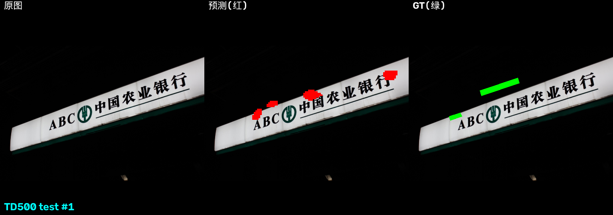
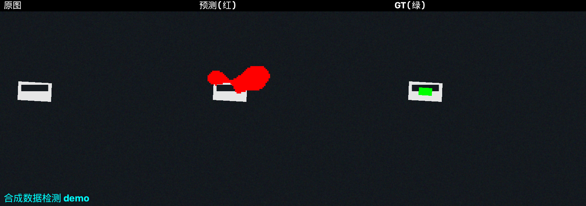
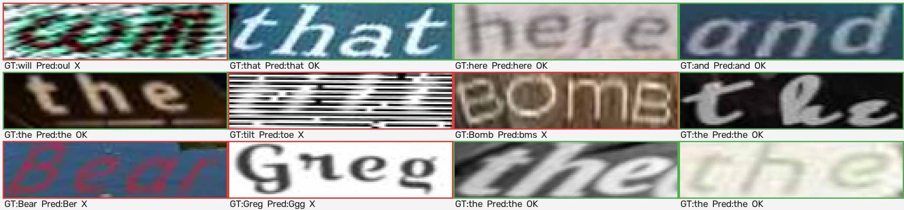

# 实验数据汇总（Key Results）

> 本页把整个项目的**关键实验数据**用表格集中整理（所有数字来自实测日志，
> 可复现；对应权重见 [权重清单](checkpoints-inventory.md)）。

---

## 1. Demo 展示

| Demo | 图 | 说明 |
|---|---|---|
| 检测 · TD500 真实图 |   | 自研 DBNet 在 MSRA-TD500 测试图上的预测（红=预测，绿=GT，`det_td500_neg1b.pt`）|
| 检测 · 合成图 |  | 合成整图检测（`det_synth_v2.pt`）|
| 识别 · 真实词裁剪 |  | SynthText 真实词裁剪识别：绿框=对，红框=错（`ctc_real62c.pt`）|
| 端到端 · 真实照片 |  | CRAFT 检测 + 自研 CTC 识别（`ctc_real62c.pt`）|

---

## 2. 检测头：修复链数据（死区根因 → 一行修复）

### 2.1 训练曲线对照（TD500，唯一变量 = `neg_ratio`）

| 指标 | `neg_ratio=3`（修复前） | `neg_ratio=1`（修复后） |
|---|---|---|
| binary 损失（Dice） | 恒 **1.000**（分支死亡） | 0.60~0.96（分支复活） |
| shrink 损失（OHEM BCE） | 恒 0.562（不动点） | 0.70~0.76（正常波动） |
| val IoU | 恒 **0.000** | **0.046 → 0.082（上涨）** |

### 2.2 骨干训练对照（SynthText，唯一变量 = `train_backbone`）

| 配置 | 800 步后 val IoU |
|---|---|
| 冻结骨干（只训检测头） | **0.393**（能学到） |
| 骨干可训练（`--train_backbone`） | **0.000**（永久死区） |

### 2.3 TD500 三组对照（300 张图，公平确定性评估 200 张）

| 配置 | 训练时 best IoU | 确定性 mean IoU | 召回 | >0.1 占比 |
|---|---|---|---|---|
| A. 全冻结（基线） | 0.082 | **0.060** | **0.226** | 25.5% |
| B. 仅微调解冻 neck | 0.117 | 0.054 | 0.166 | 24.5% |
| C. 合成+微调都训 neck | 0.133 | 0.056 | 0.159 | 26.5% |

**结论**：三组确定性均值挤在 0.053~0.060（噪声范围内）——**瓶颈是数据规模（300 张），不是特征适配层**。训练时 IoU 的差异是 8 张随机评估的噪声。

### 2.4 合成域验证（证明实现正确）

| 配置 | 指标 |
|---|---|
| 合成矩形冒烟（单图过拟合） | IoU **100%** |
| 合成整图（旧版，8/28） | IoU **0.943** |
| 合成整图（当前代码 + 预训练骨干，`det_synth_v2.pt`） | IoU **0.847** |

---

## 3. 识别头：完善链数据（数据管线 → 两阶段训练）

### 3.1 合成域

| 配置 | 整串准确率 |
|---|---|
| 10 数字词表（`ctc_digits.pt`） | **98.5%** |
| 36 字符词表（旧，`ctc_full.pt`） | **94.5%** |
| **62 字符词表**（`ctc_synth62.pt`） | **95.5%** |

### 3.2 真实域微调链（SynthText 词级，62 词表）

| 版本 | 裁剪方式 | 数据量 | 步数 | 整串准确率 |
|---|---|---|---|---|
| v1（`ctc_real62.pt`） | 轴对齐外接矩形 | 270k | 5000 | 21.5% |
| v2（`ctc_real62b.pt`） | **透视矫正**（wordBB 4 点） | 60k | 16000 | 40.9% |
| v3（**`ctc_real62c.pt`**） | 透视矫正 | **150k** | 12000 | **60.6%**（字符 76.2%）|

**结论**：裁剪方式（+65% 相对提升）和数据量是两大杠杆；v3 之后 16000+ 步出现**过拟合**（val 回落），60.6% 是小模型（655K 参数）+ 当前增强的合理平台。

### 3.3 工程性能优化

| 方案 | 训练速度 |
|---|---|
| 在线透视裁剪 + 增强 | 0.1 步/s（不可用） |
| **离线预裁剪缓存**（150k 词 79 秒生成） | **17~19 步/s** |

---

## 4. 数据管线验证（排查期探针）

| 检查项 | 结果 |
|---|---|
| 骨干特征健康度（均值/方差/空间方差） | ✅ 正常（空间方差 0.09~0.21）|
| 预训练权重加载 | ✅ 154 权重，0 missing |
| GT 掩膜对齐（掩膜内/外边缘强度比） | ✅ SynthText 8/8，TD500 7/8（1 张低对比）|
| 梯度流向 | ✅ 检测头所有层有梯度 |
| SynthText 数据质量审计 | ⚠️ txt 仅 16.5% 词级对齐，charBB 仅 17% 对齐 → 采用 1:1 子集 + 严格过滤 |

---

## 5. 一句话总结

- **检测**：实现正确（合成 0.94）；真实域曾被"OHEM 不动点死锁"卡死 → `--neg_ratio 1` 一行修复 → 300 张数据下确定性 IoU ~0.06，瓶颈在数据规模。
- **识别**：合成 95.5% → 真实 60.6%；数据管线（透视矫正 + 预裁剪）是关键工程，v3 后过拟合，需更大模型/全量数据继续提升。
